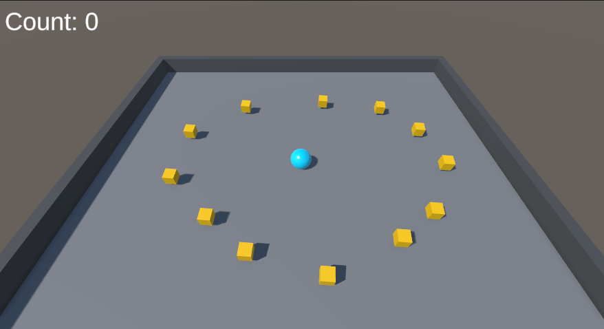

# Roll a Ball

## Overview
["Roll a Ball"](https://learn.unity.com/project/roll-a-ball?uv=2022.3) is a simple 3D game developed as part of the "3D-Unity Game Development" course at the [Romanian-American University](https://www.rau.ro/?lang=en). In this game, players control a ball that rolls around a platform, collecting objects while avoiding obstacles.

## Installation
To set up the project locally, follow these steps:
1. Clone the repository:
```
git clone https://github.com/mariajosesalasmiranda/Roll-a-Ball.git
```
2. Open the project in Unity:
- Launch Unity Hub.
- Click on "Add" and select the cloned project directory.
3. Install dependencies:
- Ensure you have the correct version of Unity installed (check the project's settings for the version).
- Open the project in Unity to download and install any necessary packages.

## Usage
Open the project in Unity.
Load the main scene located in the Assets/Scenes directory.
Press the "Play" button in the Unity Editor to start the game.

## Gameplay
In "Roll a Ball," you control a ball that rolls around a platform. Your goal is to collect all the objects scattered across the platform. The game is over once all objects are collected.

## Controls
Arrow Keys / WASD: Move the ball

## Credits
- Developed by @mariajosesalasmiranda
- Course: 3D-Unity Game Development at the Romanian-American University
